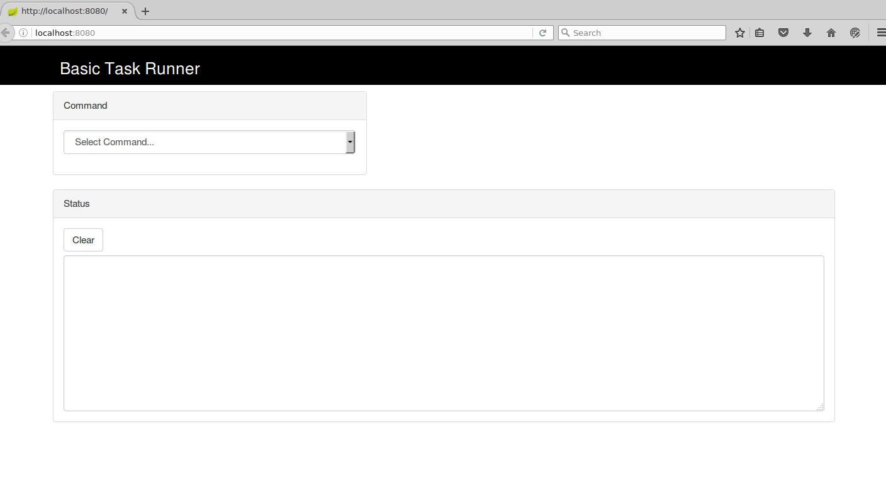
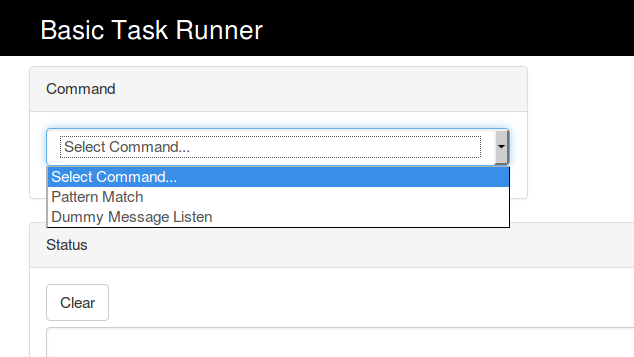
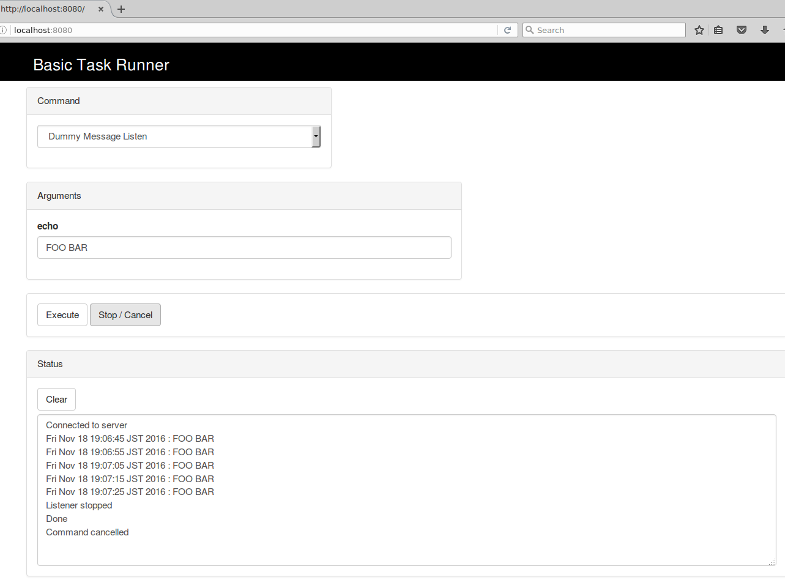
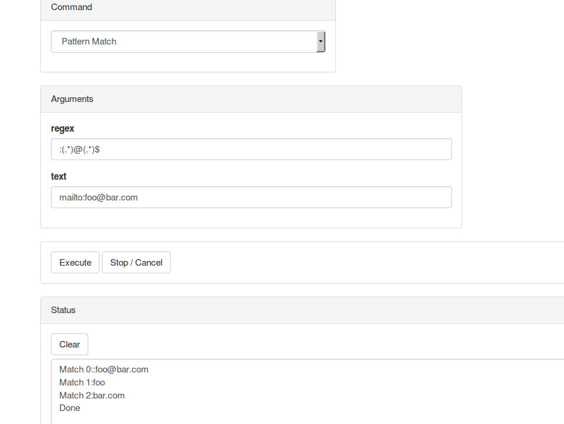

Basic Task Runner
============

Simple Spring Boot webapp for running defined tasks on the server and get 
real-time output on the web UI. This is my attempt to try out containerless 
webapp using Spring Boot, and WebSocket.

Features / Technicalities
------------
- Spring Boot web with embedded Undertow web server: No more app
server and deploying WARs!
- Non-blocking: incoming request immediately handed to work queue, so
the HTTP server layer does not need to run thread per request; WebSocket
 callback handled by Undertow also uses non-blocking NIO.
- Spring config using annotation - but importantly **no** confusing `@Autowire`
or `@ComponentScan`.
- UI input panel built dynamically with JQuery, by fetching task definitions
on server with AJAX, served by Spring as a simple JSON endpoint.
- Currently 2 sample "dummy" tasks defined:
    - Pattern Match: basic one-shot request for server to do a regex match then
    return matches.
    - Message Listen: a dummy long-running task that echoes some text on 
    interval.
- Extend with more task/command types by simply implementing a command 
interface and add to the registry class.
- My typical use is as a quick-and-dirty UI for some common development tasks.
Say I need to check message on some topic regularly, but the content is not easy
to read in raw. Then I can write a simple listener with some formatting logic,
possibly taking some args as filter, and add that as a task.

Screenshots
------------

Configuration
-------------
Default values in `basic-task-runner-webapp/src/resources/application.properties` can be changed if needed.

Build
-----
1. From root dir, do `mvn clean package`
2. The packaged stand-alone jar is created to `basic-task-runner-webapp/target/basic-task-runner-webapp-1.0-SNAPSHOT.jar`

Run
---
Just run the jar directly:

	java -jar basic-task-runner-webapp/target/basic-task-runner-webapp-1.0-SNAPSHOT.jar

